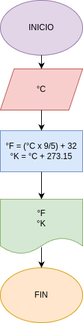

# Programa 4: Convertor_de_temperatura
programa en python para convertir grados celcius en fahrenheit y kelvin

## Analisis

### Variables de entrada
- °C = Grados celcius

### Procesamiento
- °F = grados fahrenheit
- °K = grados Kelvin

- °F = (°C x 9/5) + 32
- °K = °C + 273.15

## Diseño

## Construccion
- codigo implementado en convertor_de_temperatura.py